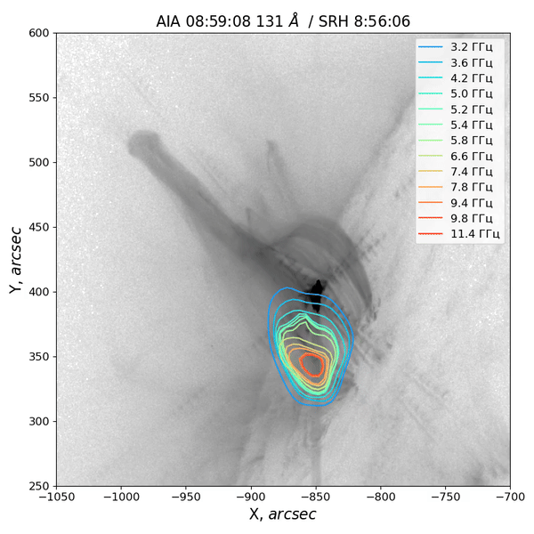

# Пространственно-временная эволюция солнечной вспышки по данным СРГ
На это странице представлен результат работы специального алгоритма, который позваляет из массива синтезированных **радиокарт
Сибирского радиогелиографа** получить наглядную видео-демонтрацию пространственно-временную эволюцию вспышечного события.
Кроме данных Сибирского радиогелиографа возможно использовать данные аппарата SDO/AIA, радиогелиографа Nançay (NRH), 
ASO-S/LST (Ly-alpha), также возможно дополнение другими необходимыми данными.

## Видео-демонстрация
Примеры результата программы. На фоне данные SDO/AIA, контуры построены по радиокартам СРГ. 

#### Контуры СРГ на уровне 35%:

#### Контуры СРГ на уровне 20%:

Требуется доработка для лучшего результата.
